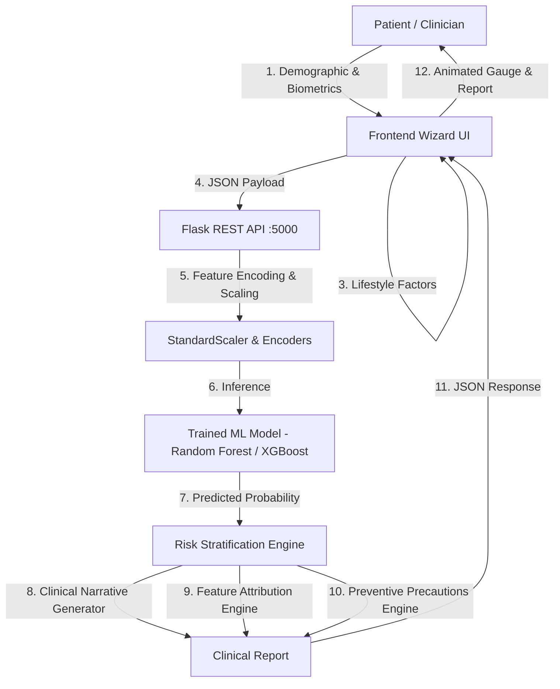

# Early Detection of Type 2 Diabetes Mellitus Using Machine Learning
### VTU Final Year Project — Clinical Decision Support & Predictive Intelligence System

A full-stack clinical-grade web application that leverages machine learning to predict Type 2 Diabetes Mellitus (T2DM) risk, provides clinical-grade explanations for individual biomarker contributions, and generates tailored preventive roadmaps.

---

## 🌟 Key Highlights & Innovations

- **100,000 Patient Cohort with 18 Features**: Augmented dataset combining base clinical indicators (HbA1c, fasting glucose, BMI) with lifestyle and genetic determinants (family history as Yes/No, diet quality, physical activity, waist circumference, stress level, sleep duration).
- **Multi-Model Machine Learning Benchmark**: 6 ML classifiers evaluated (Random Forest, XGBoost, Logistic Regression, Gradient Boosting, SVM, KNN) with accuracy, ROC-AUC, Precision, Recall, and F1 metrics.
- **Explainable AI (XAI)**: Feature attribution ranking that explains *why* a particular risk level was assigned.
- **Professional Clinical Statements**: Detailed medical narratives dynamically constructed from patient parameters instead of generic binary outputs.
- **Tri-Domain Actionable Precautions**: Interventions categorized into Immediate Actions, Lifestyle/Dietary Modifications, and Clinical Follow-ups.
- **Interactive Multi-Step Wizard UI**: Premium glassmorphism dark-mode health-tech interface built with vanilla HTML5, CSS3, and JavaScript.

---

## 🏗️ Architecture



---

## 📊 Dataset Features (19 Parameters)

| # | Feature Name | Description | Clinical Importance |
|---|---|---|---|
| 1 | `gender` | Biological Sex (Male / Female / Other) | Demographic baseline |
| 2 | `age` | Age in years (18–90) | Risk increases progressively over age 45 |
| 3 | `pregnancies` | Number of pregnancies (0–15, Female only) | Gestational diabetes history & multiparity metabolic strain |
| 4 | `hypertension` | Diagnosed high blood pressure (1/0) | Metabolic syndrome co-morbidity |
| 5 | `heart_disease` | History of cardiovascular disease (1/0) | Shared vascular pathophysiology |
| 6 | `smoking_history` | never, former, current, ever, not current | Endothelial dysfunction & oxidative stress |
| 7 | `bmi` | Body Mass Index (kg/m²) | Peripheral insulin resistance indicator |
| 8 | `HbA1c_level` | Glycated Hemoglobin (%) | 90-day mean glycemic control |
| 9 | `blood_glucose_level` | Fasting plasma glucose (mg/dL) | Immediate glycemic homeostasis marker |
| 10 | `family_history` | **Yes / No** (1st-degree relative) | 2–6× hereditary risk elevation |
| 11 | `physical_activity` | Sedentary, Light, Moderate, Active | Glucose uptake via muscle GLUT4 transporters |
| 12 | `diet_quality` | Poor, Average, Good, Excellent | Glycemic load & dietary fiber protective effect |
| 13 | `stress_level` | Scale of 1–10 | Cortisol-mediated insulin resistance |
| 14 | `sleep_hours` | Hours/night (3–12) | Sleep loss disrupts glucose metabolism |
| 15 | `alcohol_consumption` | None, Occasional, Moderate, Heavy | Hepatic gluconeogenesis interference |
| 16 | `waist_circumference` | Waist in cm | Visceral adiposity predictor |
| 17 | `cholesterol_total` | Total Serum Cholesterol (mg/dL) | Dyslipidemia assessment |
| 18 | `bp_systolic` | Systolic Blood Pressure (mmHg) | Hemodynamic stress marker |
| 19 | `bp_diastolic` | Diastolic Blood Pressure (mmHg) | Cardiovascular resistance |

---

## 🚀 Quickstart Guide

### 1. Prerequisites
- Python 3.14+ (or Python 3.10+)
- Modern web browser (Chrome, Edge, Firefox)

### 2. Install Dependencies
```bash
cd early_detection/backend
pip install -r requirements.txt
```

### 3. Run the ML Pipeline
Execute the pipeline in sequence to generate the dataset, perform exploratory data analysis, and train the models:

```bash
# Step 1: Generate enhanced 100k-record clinical dataset
python dataset_generator.py

# Step 2: Run Exploratory Data Analysis (generates charts in backend/visualizations/)
python data_analysis.py

# Step 3: Train 6 ML models and save best model + scalers
python model_training.py
```

### 4. Start the Flask Backend Server
```bash
python app.py
```
The API starts at `http://localhost:5000`.

### 5. Launch the Frontend
Open `frontend/index.html` directly in any web browser, or serve with any static server:
```bash
# Example with Python's built-in HTTP server:
cd early_detection/frontend
python -m http.server 8000
```
Open `http://localhost:8000` in your browser.

---

## 🛠️ Language Server Fix Note
If you encounter `Error: Unsupported position encoding (PositionEncodingKind.Utf16) received from server Python Jedi`:
The workspace `.vscode/settings.json` has configured:
```json
{
  "python.languageServer": "None",
  "python.analysis.indexing": false,
  "python.analysis.typeCheckingMode": "off"
}
```
This disables the incompatible Jedi LSP protocol and prevents IDE server crashes.

---

## 🎓 Academic Viva / Project Defense Questions

1. **Why use an augmented 100k synthetic dataset?**
   - Incorporates realistic clinical covariances (e.g. higher family history and higher visceral adiposity among diabetic cohorts) while avoiding clinical HIPAA/GDPR privacy constraints.
2. **Why Random Forest / XGBoost?**
   - Non-linear relationships between waist circumference, HbA1c, fasting glucose, and stress level are modeled effectively by decision-tree ensembles without strict assumptions of linearity.
3. **How is the continuous risk score calculated?**
   - Rather than a hard 0 or 1 threshold, `model.predict_proba()` produces continuous probabilities mapped to calibrated clinical risk tiers (Low <30%, Moderate 30–70%, High ≥70%).
